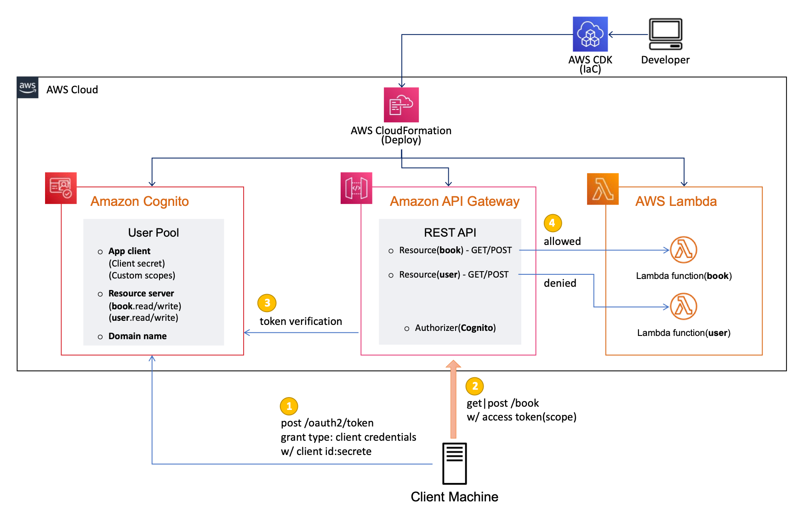
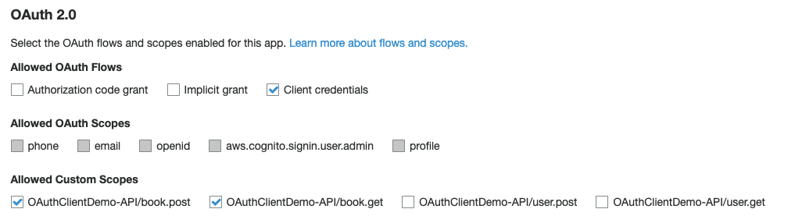
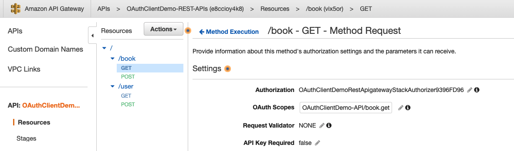

# Amazon Cognito and API Gateway based machine to machine authorization using AWS CDK

 This repository describes how to integrate Amazon Cognito User Pool(OAuth 2.0 Client credentials grant) and Amazon API Gateway(Cognito Authorizer) using AWS CDK. This sample is applicable to a usecase for machine to machine authorization rather than user-login authentication. All resources and configuration is provided through AWS CDK(typescript codes).

## Solution

Among ```Authorization Grant``` [OAuth 2.0 authorization framework](https://datatracker.ietf.org/doc/html/rfc6749) proivdes, ```[Client credentials grant](https://datatracker.ietf.org/doc/html/rfc6749#section-1.3.4)``` is used for machine to machine communication for here. We can use this flow to request an access token to access our own resources.

### Amazon Congito - User Pool

Amazon Cognito user pool supports the OAuth 2.0. Since the client credentials flow is not used on behalf of a user, only custom scopes can be used with this flow. A custom scope is one that you define for your own ```Resource servers``` in Cognito user pool. An access token returned from Cognito authorization server includes what kind of custom scopes we can access. Detail guide: 

- Create Cognito ```User Pool```
- Create ```Domain name``` in the user pool
- Create ```Resource servers``` and ```custom scopes``` in the user pool
- Create ```App client``` in the user pool,
- Enable OAuth 2.0 Client credentials in the ```App client```
- Allow custom scopes in ```OAuth 2.0 settings``` in ```App client```

### Amazon API Gateway - Cognito Authorizer

We can control access to a REST API of Amazon API Gateway using Amazon Cognito user pools as authorizer. Cognito Authizaer in Amazon API Gateway verifies the token on our behalf. The access token is used to authorize API calls based on the custom scopes of specified access-protected resources. Detail guide: 

- Create Amazon API Gateway(REST API)
- Create Authorizaer in the REST API with type = Cognito & with Cognito user pool created in Cognito User pool
- Create some resources in the REST API
- Create method in the resources with Cognito Authorizer and OAuth Scopes created in Cognito User pool

## Implementation

### Architecture



### IaC - CDK Project

All the resources described above are implemented and provided through AWS CDK ver2. Because this CDK project is built on top of [AWS CDK Project Template for DevOps
](https://github.com/aws-samples/aws-cdk-project-template-for-devops), please refer to that repository for details.

### Prerequisites

First of all, AWS Account and IAM User is required. And then the following modules must be installed.

AWS CLI: aws configure --profile [profile name]
Node.js: node --version
AWS CDK: cdk --version
jq: jq --version
curl: curl --version

### Deployment

Caution: This solution contains not-free tier AWS services. So be careful about the possible costs.

```bash
vim config/app-config-demo.json # change project's AWS Account/Region/Profile
export APP_CONFIG=config/app-config-demo.json
sh script/setup_initial.sh config/app-config-demo.json
sh script/destroy_stacks.sh config/app-config-demo.json
```

## Key Deployment Results

### App client settings in Amazon Cognito User pool



### Resource Method Request in Amazon API Gateway



## How to test

### How to get access-token

```bash
export CLIENT_ID=....... # check app client in Cognito WebConsole
export CLIENT_SECRETE=....... # check app client in Cognito WebConsole
export DOMAIN_NAME=....... # check cdk deploy output: OAuthCognitoStack.OutputCognitoUserPoolDomainName
curl -X POST --user $CLIENT_ID:$CLIENT_SECRETE $DOMAIN_NAME/oauth2/token?grant_type=client_credentials -H "Content-Type: application/x-www-form-urlencoded" 

{"access_token":".......","expires_in":86400,"token_type":"Bearer"}
```

### How to call REST API

```book``` related requests only will be successful!

```bash
export API_ENDPOINT=....... # check cdk deploy output: RestApigatewayStack.RESTAPIsEndpoint
export ACCESS_TOKEN=.......  # check client_credential's output: "access_token":"......."

curl -X GET "${API_ENDPOINT}book" -H "Authorization:${ACCESS_TOKEN}"
{"Result":"Success","Description":"your GET for /book is completed"}

curl -X POST "${API_ENDPOINT}book" -H "Authorization:${ACCESS_TOKEN}"
{"Result":"Success","Description":"your POST for /book is completed"}

curl -X GET "${API_ENDPOINT}user" -H "Authorization:${ACCESS_TOKEN}"
{"message":"Unauthorized"}

curl -X POST "${API_ENDPOINT}user" -H "Authorization:${ACCESS_TOKEN}"
{"message":"Unauthorized"}
```

### How to customize authorization(custom scopes)

Change Allow options in ```config/app-config-demo.json``` file. In this example, ```user```-related Scope Allow: false -> true.

```json
    "OAuthCognito": {
        "Name": "OAuthCognitoStack",

        "UserPoolName": "UserPool",
        "UserPoolClientName": "OAuthClient",
        
        "CognitoDomainPrefix": "api",

        "ResourceServerIdentifier": "API",
        "ResourceServerScopes": [
            {"Key": "ScopeBookGet", "Scope":"book.get", "Allow": true},
            {"Key": "ScopeBookPost", "Scope":"book.post", "Allow": true},
            {"Key": "ScopeUserGet", "Scope":"user.get", "Allow": false},
            {"Key": "ScopeUserPost", "Scope":"user.post", "Allow": false}
        ]
    },
```

 And then re-deploy ```OAuthCognitoStack``` Stack like this command.

```bash
cdk deploy *OAuthCognitoStack --profile [your-profile]
```

Before request ```user``` resource again, you must request access-token first!

```bash
curl -X POST --user $CLIENT_ID:$CLIENT_SECRETE $DOMAIN_NAME/oauth2/token?grant_type=client_credentials -H "Content-Type: application/x-www-form-urlencoded" 
{"access_token":".......","expires_in":86400,"token_type":"Bearer"}
export ACCESS_TOKEN=.......  # check client_credential's output: "access_token":"......."

curl -X GET "${API_ENDPOINT}user" -H "Authorization:${ACCESS_TOKEN}"
{"Result":"Success","Description":"your GET for /user is completed"}

curl -X POST "${API_ENDPOINT}user" -H "Authorization:${ACCESS_TOKEN}"
{"Result":"Success","Description":"your POST for /user is completed"}
```

## Clean up

```bash
sh script/setup_initial.sh config/app-config-demo.json
```

Caution: You must ```delete``` Amazon Cognito User Pools manually because of removal policy.

## Security

See [CONTRIBUTING](CONTRIBUTING.md#security-issue-notifications) for more information.

## License

This library is licensed under the MIT-0 License. See the LICENSE file.
